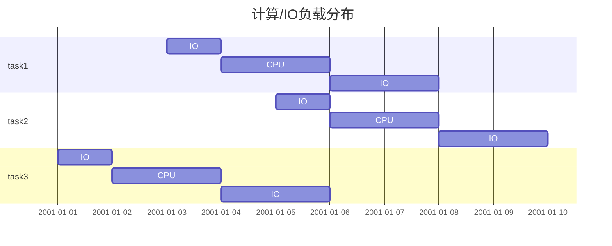
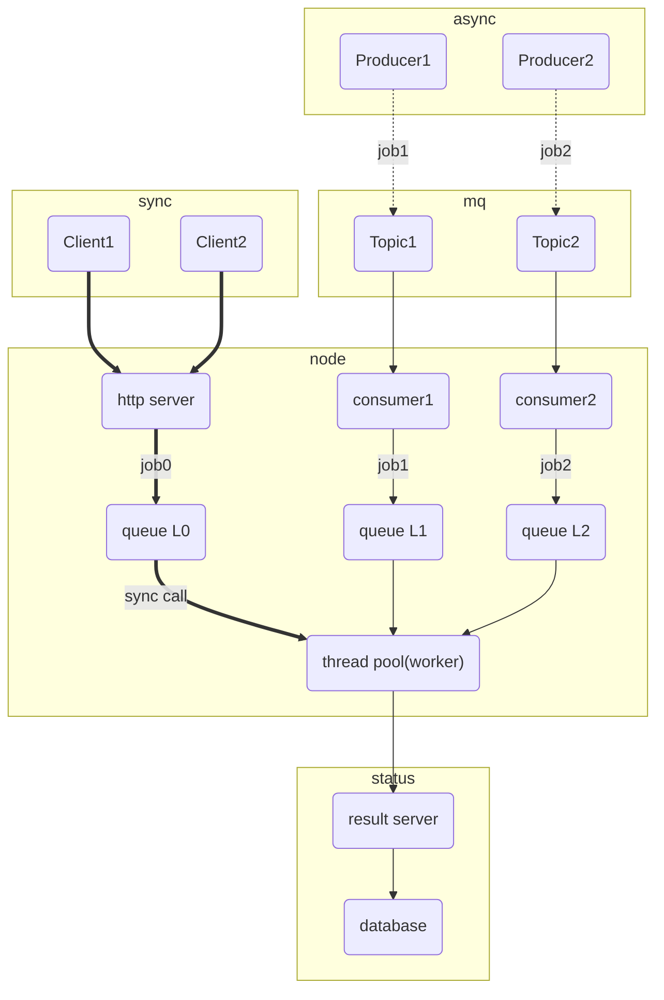
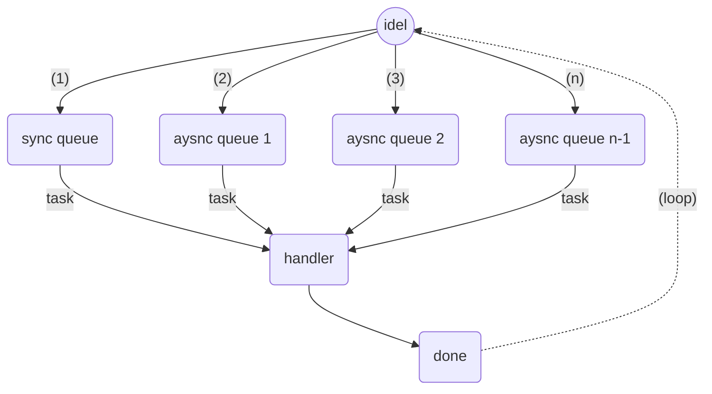

## 1.概述
### 1.1.问题描述
容器化+微服务是现如今很多后端服务系统的流行架构，而在电商、社交等场景中，流量呈现明显的波峰波谷现象，从而使得整体集群利用率不高。
针对上述问题，通常需要从集群层面，根据负责特征（平均CPU负载、实时QPS），动态扩缩容服务节点。但这种方案往往无法处理突发型流量暴涨。
其实，实际应用场景中除了大量实时增量任务，同事还会有海量的存量任务或者异步任务。所以，可以考虑利用异步任务来填充机器空闲的资源，从而提高资源利用率。

### 1.2.适用特征
* 任务有限时长内完成（秒级或者分钟级），通常CPU密集型任务
* 异步任务允许在较长时间内完成，比如24小时；长期有大量异步任务待处理
* 任务同时含IO和CPU负载，且理论上单节点CPU为资源瓶颈

* 总体同步请求存在周期性波峰波谷
* 同步任务优先级高于异步任务

### 1.3.局限
* 不支持抢占式调度
* 依赖MQ实现有限的消息防丢
* 不支持同级异步任务严格顺序执行，建议组成任务组

## 2.架构

**加粗（同步调用）、虚线（异步非阻塞调用）、实现（异步阻塞调用）**

## 3.详情
### 3.1.任务调度
#### 3.2.策略
* 默认情况，同步请求优先级最高，即同步请求队列为最高优先级0级，外部同步请求调用为阻塞调用
* 异步请求可自定多个任务队列，调度顺序依次从高到底，即当第n级队列为空才检测第n+1级队列
* 执行例程不可抢占
* 控制总并发任务数

#### 3.3.流程

